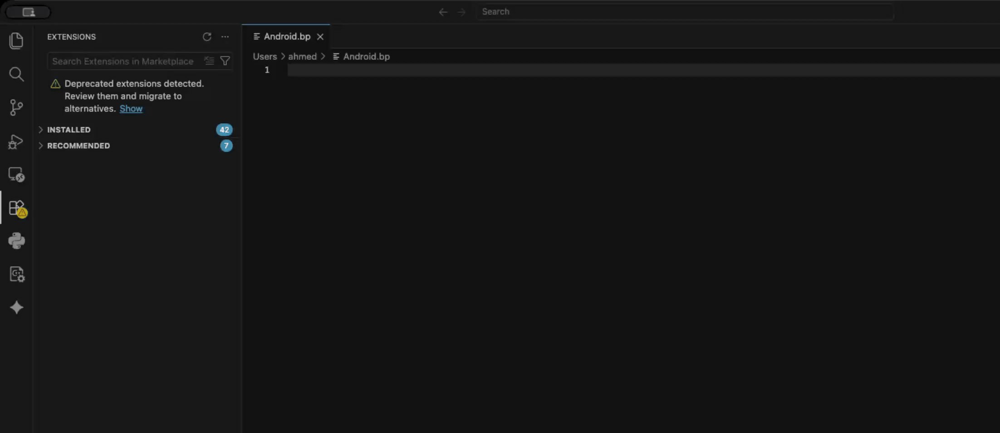

- [Android.bp Autocomplete](#androidbp-autocomplete)
  - [Features](#features)
  - [Requirements](#requirements)
  - [Installation](#installation)
    - [From VSCode Marketplace](#from-vscode-marketplace)
    - [From source](#from-source)
  - [Regenerating soong\_schema.json from AOSP](#regenerating-soong_schemajson-from-aosp)
    - [Prerequisites](#prerequisites)
      - [1. System requirements](#1-system-requirements)
      - [2. Download the AOSP source tree](#2-download-the-aosp-source-tree)
      - [3. Build the Soong documentation](#3-build-the-soong-documentation)
    - [Running the schema generator](#running-the-schema-generator)
      - [Options](#options)
      - [Examples](#examples)
  - [How it works](#how-it-works)
  - [Known limitations](#known-limitations)
  - [Contributing](#contributing)
  - [License](#license)

# Android.bp Autocomplete

A VS Code extension that brings full autocomplete, hover documentation, and property scaffolding to `Android.bp` (Soong build system) files.

If you have spent any time writing Android.bp files without tooling, you know how painful it is to look up property names and types by hand. This extension fixes that. It reads a pre-extracted `soong_schema.json` file at runtime and uses it to power everything below — no network calls, no build system required during normal use.



## Features

**Module type completions** — Start typing at the top level of any `Android.bp` file and get a list of every Soong module type (`cc_binary`, `java_library`, `apex`, and hundreds more). A preview of the module's properties appears in the documentation panel before you commit.

**Property picker** — After selecting a module type, a multi-select quick-pick opens. Pick exactly the properties you want, confirm, and a fully tabbed snippet is inserted at the cursor. The `name` property is pre-checked because every module needs it.

**Property key completions** — Inside any module block, typing the start of a property name shows context-aware completions drawn from that module's definition. Module-specific properties come first; all other known properties are available as a fallback.

**Hover documentation** — Hovering over a module type name shows its property count and a preview list. Hovering over a property key shows its type and the full description extracted from the Soong source.


---

## Requirements

- VS Code 1.75.0 or later
- No build-time dependencies during normal use — the extension ships with a pre-built `soong_schema.json` and reads it from disk at activation time.

---

## Installation

### From VSCode Marketplace
Can be installed from [here]([URL](https://marketplace.visualstudio.com/items?itemName=AbdelfattahA.android-bp-autocomplete))
### From source

```bash
# 1. Clone and install dev dependencies
git clone https://github.com/AhmedAbd-ElFattah/Android-bp-autocomplete
cd Android-bp-autocomplete
npm install

# 2. Compile TypeScript
npx tsc -p .

# 3. Package the extension
npx vsce package --no-dependencies --allow-missing-repository

# 4. Install the .vsix
code --install-extension android-bp-autocomplete-1.1.0.vsix
```

---

## Regenerating soong_schema.json from AOSP

The extension ships with a pre-built `soong_schema.json` extracted from a specific AOSP snapshot. If you need to update the data for a newer Android release, follow the steps below.

### Prerequisites

#### 1. System requirements
Refer to the official AOSP requirements documentation:
https://source.android.com/docs/setup/start/requirements

#### 2. Download the AOSP source tree
Follow the official AOSP download guide:
https://source.android.com/docs/setup/download

Use a tagged release rather than a moving branch to get reproducible results.


#### 3. Build the Soong documentation

This is the only build step required. It generates the HTML reference that the schema generator reads.

```bash
source build/envsetup.sh
lunch
m soong_docs
```

The build typically takes 5 to 30 minutes depending on your machine. When it finishes, the following file will exist:

```
out/soong/docs/soong_build.html
```

If the build fails, check that your system packages are all installed and that you ran `source build/envsetup.sh` and `lunch` in the same shell session.

---

### Running the schema generator

Once the Soong docs are built, install the Python dependency and run the script:

```bash
# From the root of this repository
pip install beautifulsoup4

python3 tools/generate_schema.py ~/aosp # assuming ~/aosp is the AOSP path
```

The script validates the path before doing anything:

- It checks that the directory exists and looks like an AOSP checkout (by looking for `build/soong`, `bionic`, `frameworks/base`, and other well-known paths).
- It checks that `out/soong/docs/soong_build.html` is present.
- If anything is wrong, it exits immediately with a clear message explaining what is missing and how to fix it.

On success it writes `soong_schema.json` to the current directory.

#### Options

```
usage: generate_schema.py [-h] [--output FILE] [--verbose] AOSP_ROOT

positional arguments:
  AOSP_ROOT             Absolute or relative path to the root of an AOSP checkout.

options:
  -h, --help            Show this help message and exit.
  --output FILE, -o FILE
                        Output file path. Defaults to 'soong_schema.json' in
                        the current working directory.
  --verbose, -v         Print each module name as it is processed.
```

#### Examples

```bash
# Default output (soong_schema.json in the current directory)
python3 tools/generate_schema.py ~/aosp

# Write to a custom path
python3 tools/generate_schema.py ~/aosp --output soong_schema.json

# Print every module name as it is parsed
python3 tools/generate_schema.py ~/aosp --verbose

# Relative path also works
python3 tools/generate_schema.py ../../aosp
```

---

## How it works

When the extension activates (the first time a file named `Android.bp` is opened), it reads `soong_schema.json` from its own directory. That JSON maps each module type to an array of property definitions, each with a name, type string, and description. The three providers — completion, hover, and the quick-pick command — all draw from that in-memory map.

Brace-depth counting and backwards identifier scanning determine which completions are appropriate at the current cursor position: module type names at the top level, property keys inside a block.

---

## Known limitations

- Properties inside nested blocks (e.g. `arch { x86 { ... } }`) are offered the same module-level completions rather than arch-specific ones. Deeper context tracking would be needed to fix this.
- The `soong_schema.json` bundled with a given release reflects a specific AOSP snapshot. Modules added after that snapshot will not appear until you regenerate it using the steps above.

---

## Contributing

Pull requests are welcome. The most useful contributions are:

- Bug reports with a minimal `Android.bp` file that triggers unexpected behavior
- Improved nested-block context detection

---

## License

MIT. See [LICENSE](LICENSE) for the full text.
